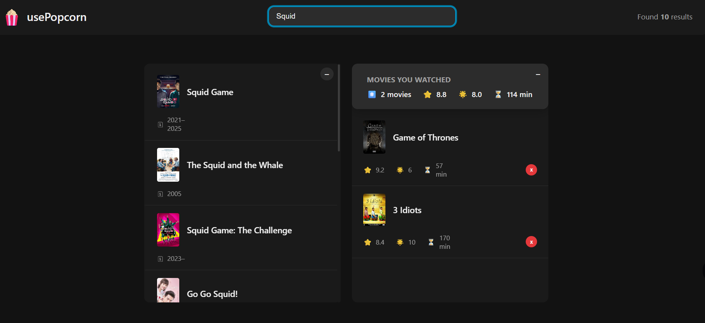

<h1 style="text-align: center;">Movie Data Fetch App</h1>


## 📸 Screenshots

Here are some previews of the **Movie Data Fetch App** in action:

<p align="center">
  
</p>

## 🚀 Tech Stack & Badges

| Technology | Badge                                                                                             |
| ---------- | ------------------------------------------------------------------------------------------------- |
| React      |                |
| JavaScript |  |
| HTML5      |                     |
| CSS3       |                        |
| Api        |                             |
| GitHub     |                  |
| npm        |                           |
| VS Code    |  |

## 📖 About This Project

The **Movie Data Fetch App** is an interactive web application built with **React** (using Vite as the bundler).  
It allows users to search for movies, view detailed information, rate movies, and maintain a watched list.

### 🔹 How It Works

1. When the app starts, it initializes the state using **React Hooks** like `useState` and custom hooks (`useMovies`, `useLocalStorageState`, `useKey`).
2. Movie data is **fetched from the OMDB API** using an **API key**.
   - Users can search movies using the search input.
   - The app uses **`fetch()`** inside the `useMovies` hook to load data based on the search query.
   - Only queries with 3 or more characters are sent to the API to reduce unnecessary requests.
3. Users can:
   - Search for movies by title
   - Click on a movie to view details
   - Add movies to their watched list
   - Rate movies using a **star rating system**
   - Delete movies from the watched list
4. The UI dynamically updates based on app state:
   - Displays loading indicators while fetching
   - Shows error messages if the API request fails
   - Updates watched movies summary (average IMDb rating, user rating, runtime)
5. At the end, users can maintain a personalized watched list and track ratings for all movies they have interacted with.

### 🔹 Data Fetching (OMDB API)

- The app fetches movie data from **OMDB API** using an API key:

```javascript
const KEY = "83b6ec03"; // your OMDB API key

const res = await fetch(`https://www.omdbapi.com/?apikey=${KEY}&s=${query}`);
const data = await res.json();
```

### 🔹 Key Features

- ✅ Fetches movie data dynamically from **OMDB API** using an API key
- ✅ Real-time search with query-based API requests
- ✅ Detailed movie view with poster, plot, cast, director, runtime, and IMDb rating
- ✅ Add movies to a **watched list** stored in `localStorage`
- ✅ Rate movies using a custom **star rating system**
- ✅ Dynamic UI with loading indicators, error handling, and interactive components
- ✅ Modern **React Hooks** (`useState`, `useEffect`) and custom hooks (`useMovies`, `useLocalStorageState`, `useKey`)

## ⚛️ React Concepts Used

| Concept                            | Description                                                                      | Example in Project                                                                |
| ---------------------------------- | -------------------------------------------------------------------------------- | --------------------------------------------------------------------------------- |
| `useState`                         | Hook for managing local state (e.g., search query, selected movie, user rating). | Used to track current search, selected movie ID, watched movies, and star rating. |
| `useEffect`                        | Hook for handling side effects such as fetching data or updating the DOM.        | Used to fetch movies from OMDB API and update document title dynamically.         |
| Custom Hook `useMovies`            | Encapsulates API fetching logic and state for movies.                            | Handles searching movies, loading state, and error messages.                      |
| Custom Hook `useKey`               | Detects keypress events and triggers callbacks.                                  | Used to close movie details on `Escape` key press and reset search on `Enter`.    |
| Custom Hook `useLocalStorageState` | Persists state to `localStorage` for long-term storage.                          | Used to store and update the watched movies list so it persists between sessions. |

## ⚙️ Installation & Setup (Local Machine)

Follow these steps to run the **Movie Data Fetch App** locally on your machine:

### 1️⃣ Clone the Repository

```bash
git clone https://github.com/Kazi-Irfanul-Islam/Movie-Data-Fetch-App.git
```

### 2️⃣ Navigate into the Project Directory

```bash
cd Movie-Data-Fetch-App
```

### 3️⃣ Install Dependencies

Make sure you have **Node.js** and **npm** (or yarn/pnpm) installed, then run:

```bash
npm install
```

### 4️⃣ Start the Development Server

```bash
npm start
```

This will start the app on **http://localhost:3000/**

### 5️⃣ Build for Production (Optional)

```bash
npm run build
```

### 6️⃣ Preview the Production Build (Optional)

```bash
npm run preview
```

### ✅ Requirements

- Node.js ≥ 16.x
- npm ≥ 8.x (or yarn/pnpm)

## Author

**Kazi Irfanul Islam Payel**

- GitHub: [https://github.com/Kazi-Irfanul-Islam](https://github.com/Kazi-Irfanul-Islam)
- Email: irfanulislam01851@gmail.com

---

## License

This project is licensed under the MIT License.  
See the [LICENSE](./LICENSE) file for details.

---
